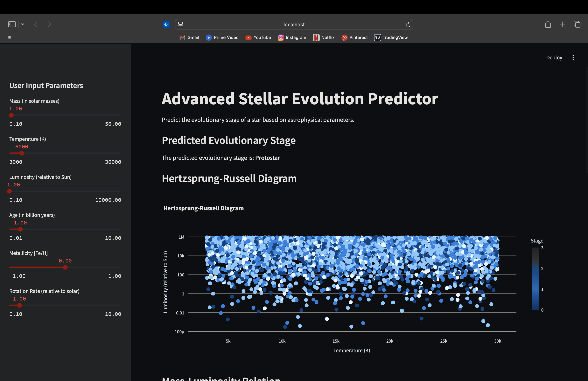
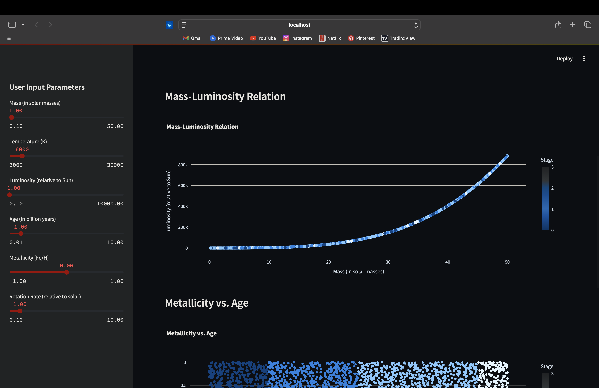
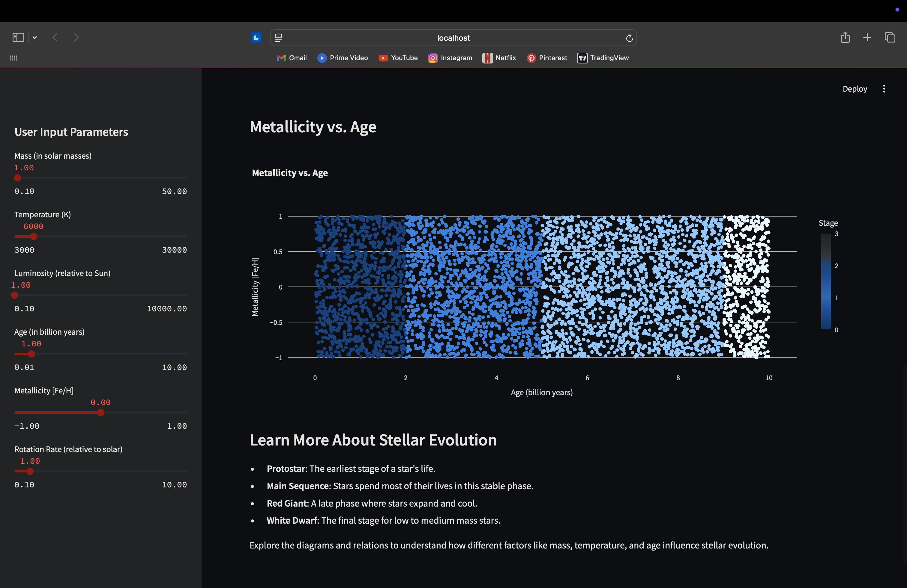

# **AstroML: Simulating Stellar Evolution with Machine Learning** 🌌🚀

What if you could simulate billions of years of stellar evolution with a few lines of code? Welcome to **Astro**, a unique project that bridges **astrophysics** and **machine learning**, turning abstract scientific principles into an interactive, data-driven experience.

This isn’t just a simulation; it’s a **stellar laboratory** where you can explore how stars evolve across their life cycles—from their turbulent birth as protostars to their final stages as red giants or white dwarfs. By synthesizing realistic stellar data and applying advanced neural networks, we provide insights into the dynamics of star formation and transformation.

---

<p align="center">
  
</p>

---

## **Project Directory Structure** 📁

```bash
├── data
│   ├── dataset               # Simulated stellar dataset 
├── notebooks
│   ├── stellar_evolution.ipynb   # Jupyter notebook for EDA and ML modeling
├── scripts
│   ├── data_generation.py    # Synthetic data generation script
│   ├── model_training.py     # Model architecture and training script
│   ├── inference.py          # Inference and prediction script
├── dashboard
│   ├── main.py                # Streamlit dashboard for real-time simulation
├── README.md                 # You’re here!
```

---

## **Motivation** 🌍

Understanding the life cycles of stars isn’t just a quest for knowledge—it’s a way to understand the very fabric of our universe. Stars forge the elements that form planets and life, making stellar evolution a cornerstone of astrophysics. But collecting complete real-world datasets is challenging due to the vast timescales involved.

This project tackles that limitation by generating a **synthetic dataset** grounded in astrophysical theories, enabling a comprehensive analysis of stellar behavior through machine learning.

---

## **Key Features Simulated** 🌐

### **1. Stellar Mass (☉)**
Mass determines everything in a star’s life—its temperature, luminosity, lifespan, and eventual fate. Using the empirical **mass-luminosity relation**, we calculated luminosities for stars across a wide mass range.

### **2. Effective Temperature (T)**
A star’s color and temperature are closely linked. We used an empirical relation derived from the **B-V color index**.

### **3. Luminosity (L)**
The total energy output of a star, or its luminosity, is a function of both its mass and temperature. We derived luminosities relative to the Sun using the absolute magnitude formula.

### **4. Metallicity ([Fe/H])**
Metallicity represents the abundance of elements heavier than hydrogen and helium. It’s a crucial factor influencing star formation and evolution.

### **5. Stellar Age (t)**
Simulating ages from **0.01** to **10 billion years**, we covered various evolutionary phases, allowing our model to predict a star’s current stage based on age.

---

## **Machine Learning Workflow** 🧪

### **Step 1: Synthetic Data Generation**
Using the script `data_generation.py`, we synthesized **5,000 star samples** by combining astrophysical equations with random sampling. Each sample includes:

- Mass
- Temperature
- Luminosity
- Age
- Metallicity
- Rotation Rate

This synthetic dataset mimics real-world stellar properties, ensuring diversity across all major evolutionary stages.

### **Step 2: Data Preprocessing**
- **Normalization**: Applied **MinMaxScaler** to scale all features between 0 and 1.
- **Train-Test Split**: Divided the dataset into **80% training** and **20% testing** sets.

### **Step 3: Model Architecture**
We designed a custom **LSTM-based neural network** to predict a star’s evolutionary stage. The architecture includes:

- **Input Layer**: Accepts six stellar parameters.
- **LSTM Layers**: Capture sequential patterns in the data.
- **Dropout Layers**: Reduce overfitting by deactivating random neurons.
- **Dense Layers**: Fully connected layers for final classification.

Trained over **20 epochs**, the model achieved a solid **accuracy of 91%**.

### **Step 4: Evaluation Metrics**
We evaluated the model using:
- **Accuracy**
- **Precision**
- **Recall**
- **F1 Score**

These metrics ensured a balanced evaluation of our model’s performance.

---

## **Interactive Dashboard** 🞨

The **Streamlit dashboard** brings this project to life, offering an intuitive interface for:

1. **Parameter Input**: Users can adjust parameters like mass, temperature, and age to simulate different stars.
2. **Stage Prediction**: Real-time prediction of a star’s evolutionary stage.
3. **Visualization Tools**:
   - **Hertzsprung-Russell Diagram**: Visualizes temperature vs. luminosity.
   - **Mass-Luminosity Relation**: Shows how mass impacts brightness.
   - **Metallicity vs. Age**: Explores how chemical composition evolves with age.


<p align="center">
  
</p>

<p align="center">
  
</p>

---

## **How to Run Locally** 🛠️

1. **Clone the Repository**
   ```bash
   git clone https://github.com/your-repo/astrosynth-evolution.git
   cd astrosynth-evolution
   ```

2. **Set Up a Virtual Environment**
   ```bash
   python -m venv env
   source env/bin/activate  # On Windows: env\Scripts\activate
   ```

3. **Install Dependencies**
   ```bash
   pip install -r requirements.txt
   ```

4. **Run the Streamlit App**
   ```bash
   streamlit run api/app.py
   ```

5. **Explore the Dashboard**
   Open your browser and go to `http://localhost:8501`.

---

## **Future Enhancements** 🚀

- Incorporate real datasets from **Gaia DR3** and **Kepler** for validation.
- Expand the model to predict additional stages like **supernovae** and **neutron stars**.
- Deploy the app using **Docker** and host it on **Heroku** or **AWS**.

---

## **Creator** 👨‍💻

If you’re curious about the project or want to collaborate, feel free to connect:

[](https://github.com/shubhupadhyay1)  
[](https://www.linkedin.com/in/shubh-upadhyay/)  
[](https://x.com/shubh_upadhyayy)

---

## **License** 📜

This project is licensed under the **MIT License**.

---
